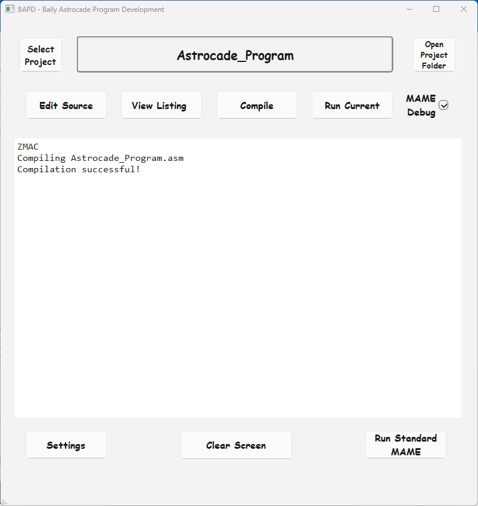

## Bally Astrocade Program Development Tool (BAPD)

**Status:** Alpha version 1.0.0 

**Author:** Dave Turner aka Commander Dave



**Overview**

The Bally Astrocade Program Development Tool (BAPD) is a Python-based application designed to assist in the development of Astrocade Z80 assembly language programs. It provides a user-friendly interface for managing projects, compiling source code, running compiled programs using MAME, and configuring various settings.

**Key Features**

* **Project Management:** Create, select, and manage Astrocade projects.
* **Compilation:** Compile source code using ZMAC.
* **Execution:** Run compiled programs in MAME in normal or debug mode.
* **Settings Configuration:** Configure settings for ZMAC and MAME.
* **User Interface:** Intuitive interface for interacting with the tool.
* **Non-Invasive:** The BAPD program is designed to be non-invasive and self-contained. It will not make any changes to your computer beyond creating a dedicated "BAPD" directory under your user profile directory. All the program's files and data will be stored within this BAPD directory, ensuring that it does not interfere with or modify anything else on your system.

## Instructions

After installing the BAPD tool, you'll find a new directory named "BAPD" within your user directory (e.g., `C:\Users\<your_username>`). This directory contains the following structure:

```
BAPD
├── Projects
│   └── Astrocade_Program
│       ├── Version_Archive
│       │   └── Astrocade_Demo_Cartridge.asm
│       ├── Astrocade_Program.asm
│       └── HVGLIB.H
```

**Breakdown:**

* **Projects:** This folder stores your Astrocade projects.
* **Astrocade_Program:** A sample project included with BAPD.
* **Version_Archive:** A folder for storing older versions of your project files (optional).
* **Astrocade_Program.asm:** The main source code file for the Astrocade program.
* **HVGLIB.H:** A header file used by the Astrocade program.

**Key Points:**

* The project name must match the name of the main source code file (e.g., `Astrocade_Program.asm`).
* The `Version_Archive` folder is not used by the BAPD tool but can be used for manual backups. You can name the backup files whatever you like.


## Installation

**Steps:**

1. **Download and Run BAPD:**
   * Download the BAPD executable from this repository. Note that it is not an installer, the .exe file is the program. It does not matter from where the program runs.
   * Run the BAPD executable file. The main program window will open.
   * **[Important]** Close the BAPD program. This allows the program to create the project directory.
   * The BAPD tool will create a directory named "BAPD" in your user directory (e.g., `C:\Users\<your_username>\BAPD`).

2. **Install MAME:**
   * Download MAME which is included in this repository for convenience. If you download it from the MAME website, you will need the 64 bit version.
   * Extract the downloaded MAME files into the `BAPD\Programs\MAME` directory.

3. **Install PSPad PORTABLE:**
   * **[IMPORTANT!]** You must get the PORTABLE version for this Alpha build.
   * Download PSPad PORTABLE which is included in this repository for convenience. If you download it from the PSPad website you will need the 64 bit version.
   * Extract the downloaded PSPad files into the `BAPD\Programs\PSPad` directory.

4. **Launch BAPD:**
   * Run the BAPD executable file again. The tool is now ready to use.


**Known Limitations**
* **MAME and PSPad Installation:** MAME and PSPad need to be installed separately.
* **Alpha Release:** Some features may be incomplete or require further development.
